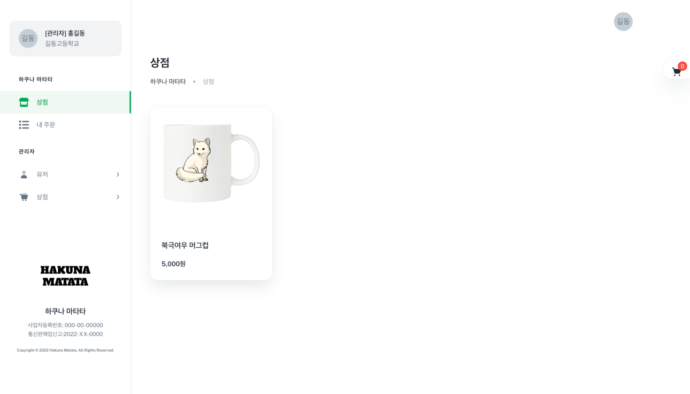
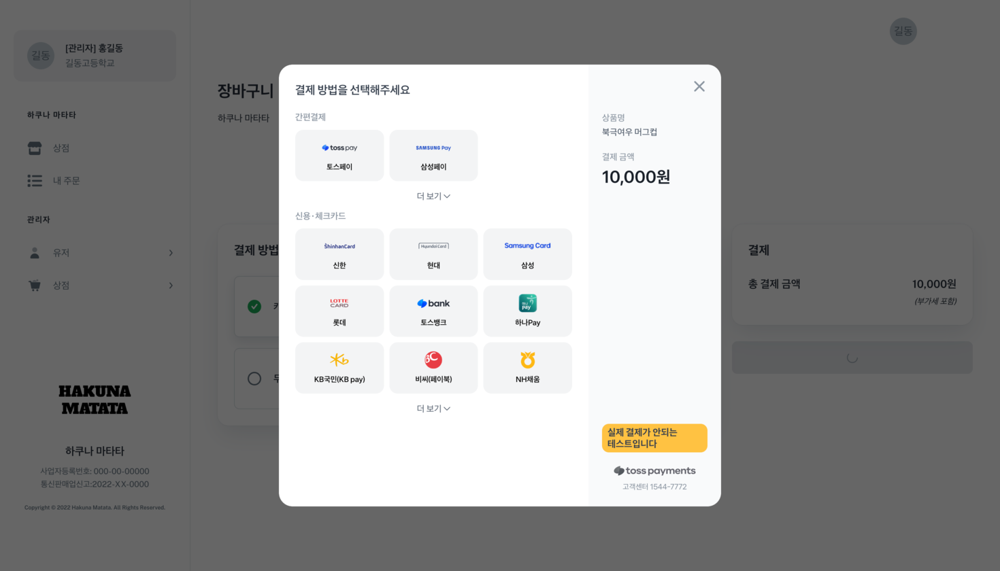

# Hakuna Matata

온라인 굿즈 쇼핑몰 사이트

## Tech Stack

### Frontend

### Backend

## Features

- 상품 목록 조회
- 상품 상세 조회
- 장바구니 담기
- 장바구니 조회
- 주문하기
- 주문 내역 조회

## Screenshots

## Authors

- [@son-daehyeon](https://www.github.com/son-daehyeon)

## Acknowledgements

- [Toss Payments API](https://docs.tosspayments.com/reference)
